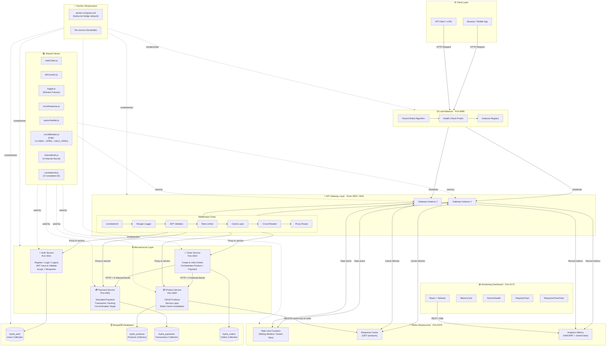
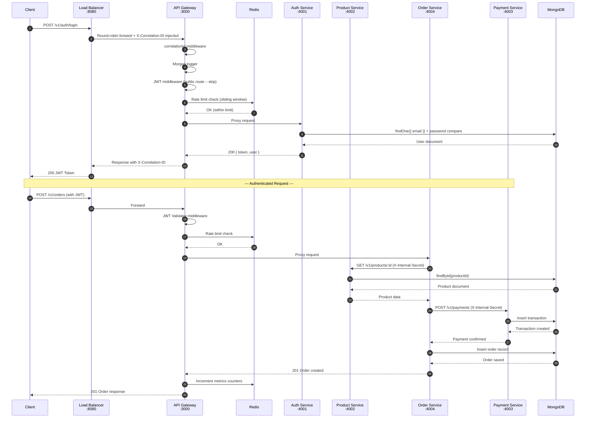
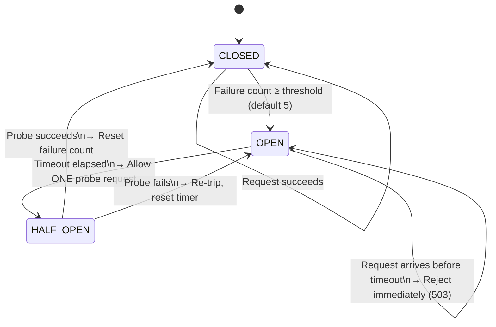
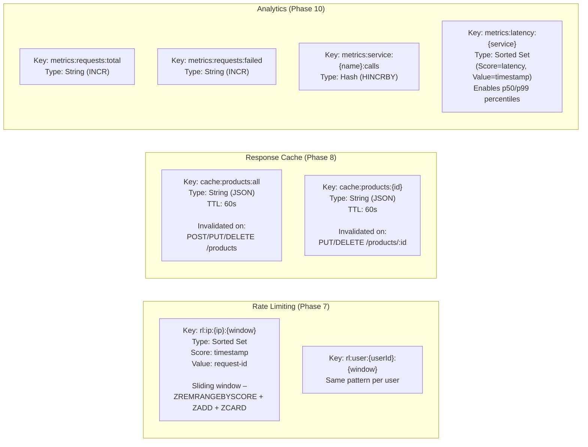
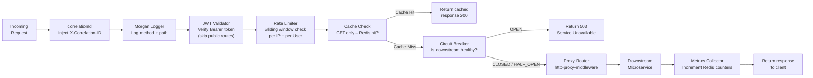
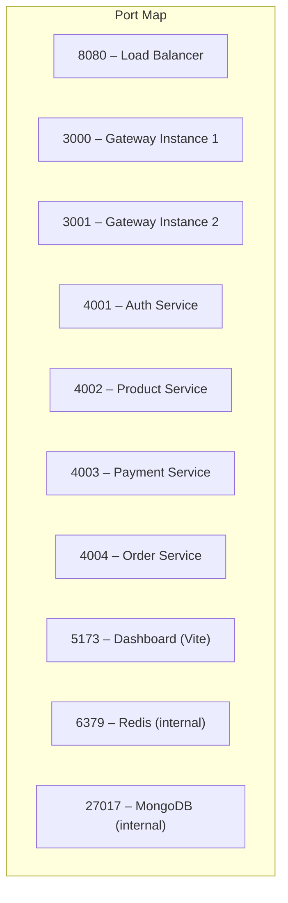
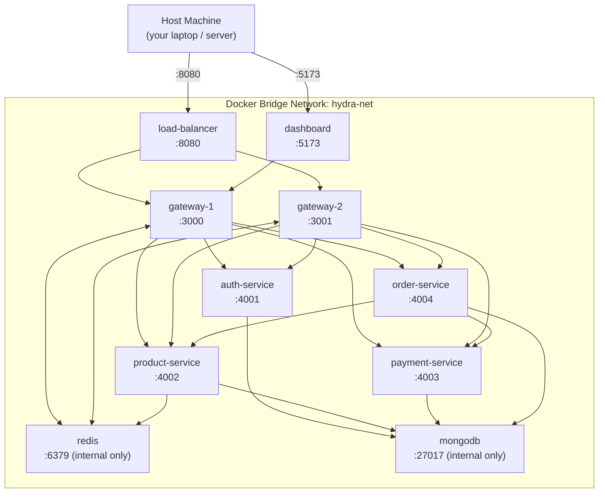

# HydraGateway – High-Level Architecture Diagram

## 1. Full System Architecture

---

## 2. Request Flow – Happy Path

---

## 3. Circuit Breaker State Machine

---

## 4. Redis Data Layer Design

---

## 5. Middleware Chain (Gateway)

---

## 6. Port Allocation

---

## 7. Docker Network Topology

