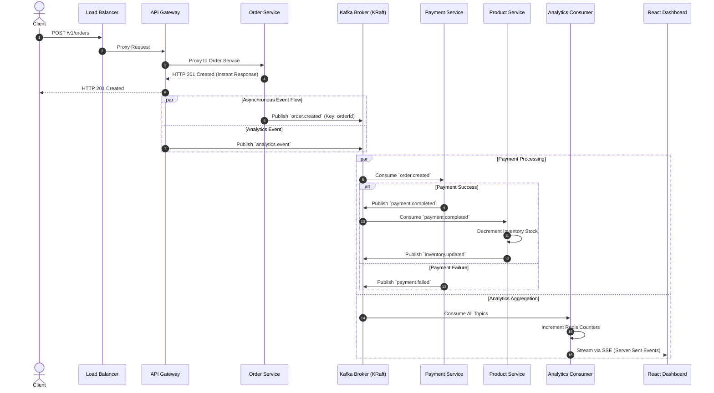

# 🐘 Apache Kafka Interview Guide & Project Deep-Dive

Welcome to the comprehensive Apache Kafka Interview & Implementation Guide for **HydraGateway**. This document is structured into 4 sections to take you from core concepts to project-specific architecture, top interview questions, and resume bullet points.

---

## 📚 Table of Contents
1. [Core Apache Kafka Concepts](#1-core-apache-kafka-concepts)
2. [Kafka Implementation in HydraGateway](#2-kafka-implementation-in-hydragateway)
3. [Top Apache Kafka Interview Questions & Answers](#3-top-apache-kafka-interview-questions--answers)
4. [Resume Guidance & Bullet Points](#4-resume-guidance--bullet-points)

---

## 1. Core Apache Kafka Concepts

### What is Apache Kafka?
Apache Kafka is an **open-source distributed event-streaming platform** designed for high-throughput, fault-tolerant, real-time data streaming and asynchronous event processing. 

Unlike traditional message queues (like RabbitMQ) that delete messages immediately after consumption, Kafka acts as a **distributed append-only commit log**. Messages are retained for a configurable period (e.g., 7 days) regardless of whether they have been consumed.

### Core Architectural Components

```
+-------------------------------------------------------------------------------+
|                               KAFKA CLUSTER                                   |
|                                                                               |
|  +---------------------------------+     +---------------------------------+  |
|  |           Broker 1              |     |           Broker 2              |  |
|  |  +---------------------------+  |     |  +---------------------------+  |  |
|  |  | Topic: order.created      |  |     |  | Topic: order.created      |  |  |
|  |  | Partition 0 [Leader]      |  |     |  | Partition 1 [Follower]    |  |  |
|  |  +---------------------------+  |     |  +---------------------------+  |  |
|  +---------------------------------+     +---------------------------------+  |
+-------------------------------------------------------------------------------+
             ^                                           |
    Produces |                                           | Consumes
             |                                           v
    +-----------------+                         +-----------------+
    |  Order Service  |                         | Payment Service |
    |   (Producer)    |                         | (Consumer Group)|
    +-----------------+                         +-----------------+
```

#### 1. Topics & Partitions
* **Topic**: A logical stream or category to which messages are published (e.g., `order.created`, `payment.completed`).
* **Partition**: A topic is divided into one or more partitions spread across brokers. Partitions allow Kafka to scale horizontally.
* **Offset**: Each message within a partition receives an incremental sequential ID called an **offset**. Offsets guarantee ordering **within a single partition**.

#### 2. Producers & Partitioning Strategy
* **Producer**: An application that writes events to Kafka topics.
* **Partitioning Strategy**:
  * **With Key**: Messages with the same key (e.g., `orderId: "ORD-123"`) are hashed (`murmur2` algorithm) and routed to the **same partition**, ensuring strict order of events per key.
  * **Without Key**: Messages are distributed round-robin across partitions for optimal load distribution.

#### 3. Consumer Groups & Scaling
* **Consumer Group**: A collection of consumer instances working together to consume data from topics.
* **1-to-1 Partition Assignment**: Each partition in a topic is consumed by **exactly one consumer** in a given consumer group at any time.
  * *3 Partitions + 3 Consumers* = 1 partition per consumer (Optimal throughput).
  * *3 Partitions + 5 Consumers* = 2 consumers sit idle.
  * *3 Partitions + 1 Consumer* = 1 consumer handles all 3 partitions.
* **Rebalancing**: When a consumer joins or leaves a group, Kafka triggers a rebalance to redistribute partition assignments.

#### 4. ZooKeeper vs KRaft Mode (Kafka Raft)
* **Legacy ZooKeeper Mode**: Relied on an external Apache ZooKeeper cluster to manage cluster metadata, leader elections, and topic configurations.
* **Modern KRaft Mode (Kafka 3.0+)**: Uses an internal Raft consensus protocol directly inside Kafka brokers.
  * Eliminates external ZooKeeper dependency.
  * Drastically speeds up metadata updates and recovery time.
  * Supports millions of partitions.

#### 5. Message Delivery Guarantees
* **At-Most-Once**: Message committed before processing. Zero risk of duplicate, risk of message loss.
* **At-Least-Once** *(HydraGateway standard)*: Message processed, then offset committed. Zero data loss, but duplicate processing possible (requires consumer idempotency).
* **Exactly-Once (EOS)**: Uses transactional producers/consumers (`read-process-write` transactions).

---

## 2. Kafka Implementation in HydraGateway

### Why Kafka in HydraGateway?
HydraGateway uses Kafka to decouple microservices, convert synchronous REST bottlenecks into an **event-driven saga flow**, and stream system metrics asynchronously into an observability dashboard.



---

### Project Topics Overview

| Topic Name | Producer Service | Main Consumer(s) | Payload / Purpose |
|---|---|---|---|
| `order.created` | `order-service` | `payment-service`, `analytics-consumer` | Trigger payment processing asynchronously after order creation |
| `payment.completed` | `payment-service` | `product-service`, `analytics-consumer` | Trigger inventory decrement after successful payment |
| `payment.failed` | `payment-service` | `analytics-consumer` | Track failed transactions and compensation alerts |
| `inventory.updated` | `product-service` | `analytics-consumer` | Record inventory stock changes |
| `analytics.event` | `gateway`, `auth-service` | `analytics-consumer` | Capture HTTP logs, user logins (`user.login`), product views |

---

### Key Code Artifacts & Implementation Details

#### 1. Kafka Producer Client ([producer.js](file:///c:/Users/admin/Desktop/Projects/ProjectSec/shared/kafka/producer.js))
* Built on **`kafkajs`**.
* **Resilience**: Configured with `KAFKA_ENABLED` flag for graceful degradation if Kafka is offline.
* **Correlation Tracing**: Automatically injects `correlationId`, `eventType`, and ISO `timestamp` into headers.
* **Local SSE Event Bus**: Exposes an `EventEmitter` (`producerEvents`) so gateway instances can broadcast live events directly to connected SSE UI clients.

#### 2. Kafka Consumer Client ([consumer.js](file:///c:/Users/admin/Desktop/Projects/ProjectSec/shared/kafka/consumer.js))
* **Consumer Group Management**: Dynamic creation of consumer groups (e.g. `analytics-event-consumer`, `payment-order-consumer`).
* **Idempotency Guard**: Contains an in-memory TTL deduplication cache (`seenIds` map, 5-minute TTL, max 10,000 IDs) to prevent duplicate processing of retransmitted messages.
* **Error Isolation**: Wraps handler execution in `try-catch` so failed messages don't block partition offsets or crash the service.

#### 3. Analytics Aggregation Service ([analytics-consumer](file:///c:/Users/admin/Desktop/Projects/ProjectSec/packages/analytics-consumer/src/server.js))
* Subscribes to **all system topics**.
* Aggregates event throughput into Redis using **Redis Pipelines**:
  * Total consumed counter (`kafka:consumed:total`)
  * Topic distribution (`kafka:consumed:topic:<topic>`)
  * Sliding window throughput per second (`kafka:events_per_sec:<bucket>`)

#### 4. Kafka Infrastructure in Docker ([docker-compose.yml](file:///c:/Users/admin/Desktop/Projects/ProjectSec/docker-compose.yml))
* Runs **Apache Kafka 3.8.0** in **KRaft Mode** (`KAFKA_PROCESS_ROLES=broker,controller`).
* Healthcheck via `/opt/kafka/bin/kafka-broker-api-versions.sh --bootstrap-server 127.0.0.1:9092`.
* Automatically creates topics with 3 partitions (`KAFKA_NUM_PARTITIONS=3`).

---

## 3. Top Apache Kafka Interview Questions & Answers

### General Kafka Fundamentals

#### Q1: How does Apache Kafka achieve such high throughput and low latency?
**Answer:**
Kafka achieves high performance through four main design principles:
1. **Sequential Disk I/O**: Kafka appends messages to linear disk log files rather than random DB access. Sequential disk reads/writes can rival RAM speed.
2. **Page Cache Utilization**: Relies heavily on the OS kernel page cache instead of JVM heap objects, avoiding garbage collection overhead.
3. **Zero-Copy Transfer (`sendfile` system call)**: Data moves directly from the page cache to the network socket without passing through JVM application memory.
4. **Batching and Compression**: Producers and consumers batch messages together (end-to-end compression via Snappy/Gzip/Lz4), reducing network roundtrips.

---

#### Q2: What is KRaft mode in Kafka and how does it differ from ZooKeeper mode?
**Answer:**
* **ZooKeeper Mode**: Kafka used an external Apache ZooKeeper cluster for metadata management, topic state, controller election, and partition leader tracking. This caused metadata synchronization bottlenecks for large clusters.
* **KRaft (Kafka Raft Consensus Protocol)**: Replaces ZooKeeper with an internal Raft quorum integrated into Kafka brokers. Controllers log state changes into a special internal topic (`@metadata`).
* **Benefits**: Faster controller failover (milliseconds instead of seconds/minutes), simplified single-technology infrastructure deployment, and scalability to millions of partitions.

---

#### Q3: How does Kafka guarantee ordering of messages?
**Answer:**
Kafka guarantees message ordering **only within a single partition**, NOT across an entire topic.
* To ensure order for related events (e.g., all state changes for `orderId: "123"`), the producer supplies a **Partitioning Key** (e.g., `orderId`).
* Kafka hashes `hash(key) % total_partitions` to send all events with that key to the **exact same partition**, preserving sequential processing order.

---

#### Q4: What is a Consumer Group Rebalance and when does it happen?
**Answer:**
Rebalancing is the process where Kafka reallocates partition ownership among consumers within a consumer group.
* **Triggers**:
  1. A new consumer joins the group.
  2. An existing consumer crashes or leaves (fails to send heartbeat within `sessionTimeout`).
  3. New partitions are added to a topic.
* **Impact**: During rebalance (especially legacy `Eager` rebalances), consumers temporarily stop reading messages. Modern Kafka uses **Cooperative Sticky Assignors** to allow incremental rebalancing with minimal interruption.

---

#### Q5: How do you handle duplicate messages in Kafka consumers?
**Answer:**
Kafka producers using At-Least-Once delivery might resend a message if an ACK is lost over the network. Consumers must handle duplicate messages by being **Idempotent**.
* **Strategies**:
  1. **Idempotency Key / Deduplication Cache**: Attach a unique `idempotencyKey` or `correlationId` in message headers and check against Redis or an in-memory TTL set before executing side-effects. (As implemented in HydraGateway's `shared/kafka/consumer.js`).
  2. **Database Unique Constraints**: Use `upsert` operations or database unique indices on business keys (e.g., `order_id`).

---

### Project-Specific Scenario Questions

#### Q6: "Can you explain how Kafka is integrated into your HydraGateway project?"
**Answer (Model Response):**
> "In HydraGateway, Kafka powers our asynchronous microservice event pipeline and real-time observability. When an order is placed via our API Gateway, `order-service` writes the order to MongoDB and immediately returns an HTTP response to the client. It asynchronously publishes an `order.created` event to Kafka with the `orderId` as the partition key.
> 
> `payment-service` consumes `order.created`, processes payment, and emits `payment.completed`. `product-service` listens for `payment.completed` to auto-decrement stock and publishes `inventory.updated`. 
> 
> Additionally, we built an `analytics-consumer` service that reads events from all topics and uses Redis pipelines to aggregate metrics per second. These metrics are streamed to a React dashboard via SSE for real-time monitoring."

---

#### Q7: "What happens in HydraGateway if the Kafka broker goes down?"
**Answer:**
> "We implemented **graceful degradation** in our custom Kafka JS wrappers. In `producer.js` and `consumer.js`, if Kafka is unreachable or `KAFKA_ENABLED` is false:
> 1. Core synchronous HTTP APIs (like user login, order placement) do NOT fail or crash.
> 2. The producer logs a structured warning and drops or fallbacks event publishing without throwing unhandled promise rejections.
> 3. Microservices continue handling direct REST traffic while background analytics/async decoupling pauses until Kafka reconnects automatically using our retry strategy."

---

## 4. Resume Guidance & Bullet Points

### Proposed Bullet Points for Your Resume

Here are ready-to-use, high-impact bullet points for your **HydraGateway** project:

* **Event-Driven Microservices Architecture**: Engineered an asynchronous event-driven pipeline using **Apache Kafka (KRaft mode)** and **Node.js (KafkaJS)** to decouple `order-service`, `payment-service`, and `product-service`, reducing API response times by handling payments & inventory updates asynchronously.
* **Message Delivery & Idempotency**: Implemented an idempotent event consumption strategy using **Correlation IDs** and a **TTL deduplication engine**, preventing duplicate event processing under At-Least-Once Kafka delivery guarantees.
* **Real-time Observability Pipeline**: Designed a high-throughput **Analytics Consumer** that ingests multi-topic Kafka events, aggregates metrics into **Redis via Pipelines**, and streams live throughput statistics to a React Dashboard via **Server-Sent Events (SSE)**.
* **Containerized Infrastructure**: Configured single-node **Kafka 3.8.0 KRaft cluster** inside **Docker Compose** with automated health checks, topic auto-creation (3 partitions), and seamless network integration across 8 microservices.

---

### What to Keep vs. What to Avoid on Resume

| Keep (High Impact) 🟢 | Avoid / Remove (Weak) 🔴 |
|---|---|
| **Specific Kafka Concepts**: KRaft mode, Partitions, Consumer Groups, Idempotency, Correlation IDs. | Generic claims like "Used Kafka for messaging". |
| **Architectural Impact**: Decoupling services, reducing latency, asynchronous Saga pattern. | Listing tools without context (e.g., just listing "Kafka, Redis" in skills without bullet points). |
| **Observability & Metrics**: Redis aggregation, SSE live streaming, throughput monitoring. | Stating "Built Kafka cluster" if it was just single-node Docker (specify Docker/KRaft accurately). |
| **Resilience & Fault Tolerance**: Graceful degradation when Kafka is down. | Claiming 99.999% uptime or multi-region replication if not implemented. |

---

### 💡 Next Steps for Resume Customization
If you'd like me to tailor your exact resume text:
1. **Paste your current project section / draft resume bullet points in the chat.**
2. I will critique each line, reframe it with strong action verbs and technical keywords, and tell you **exactly what to keep, edit, or remove!**
