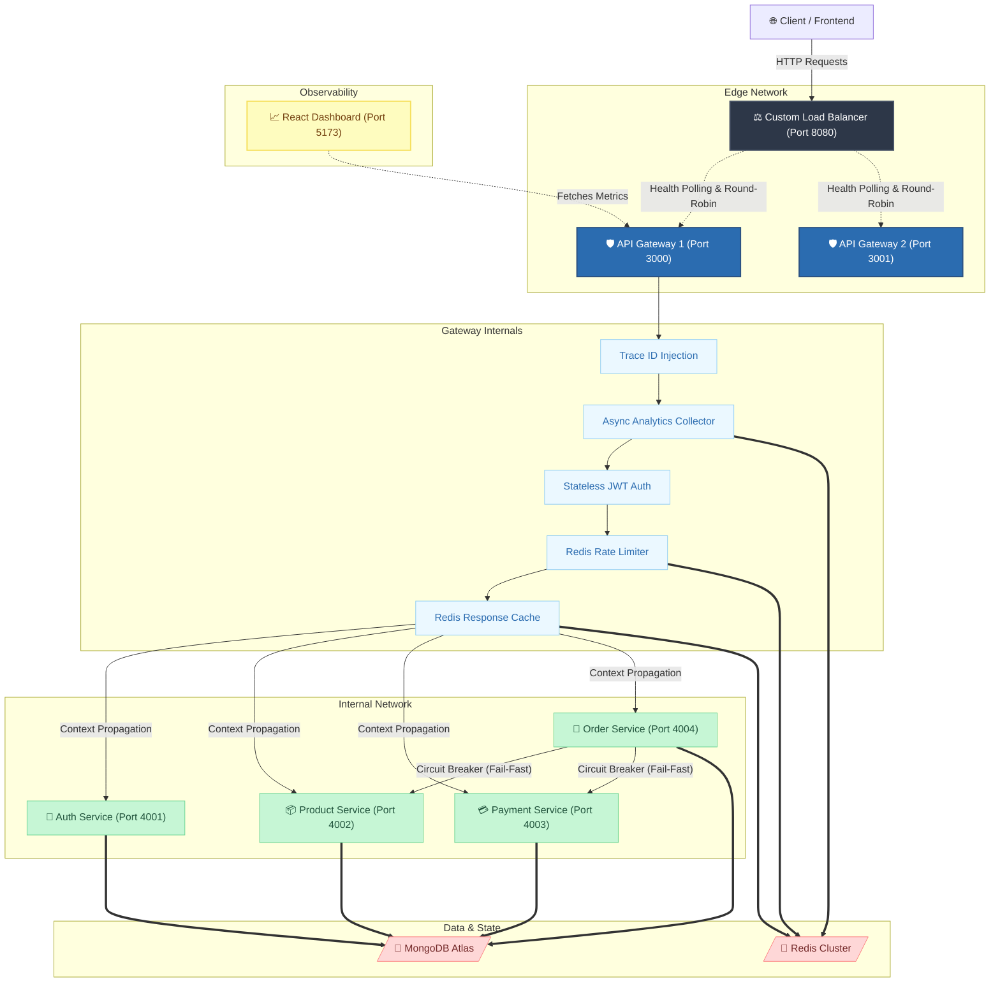
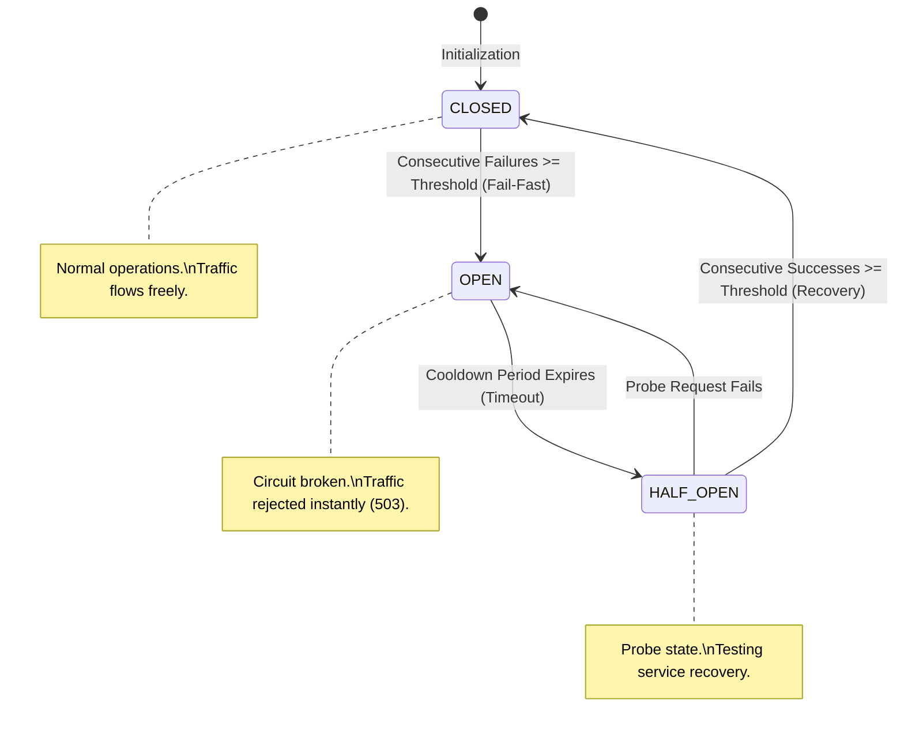
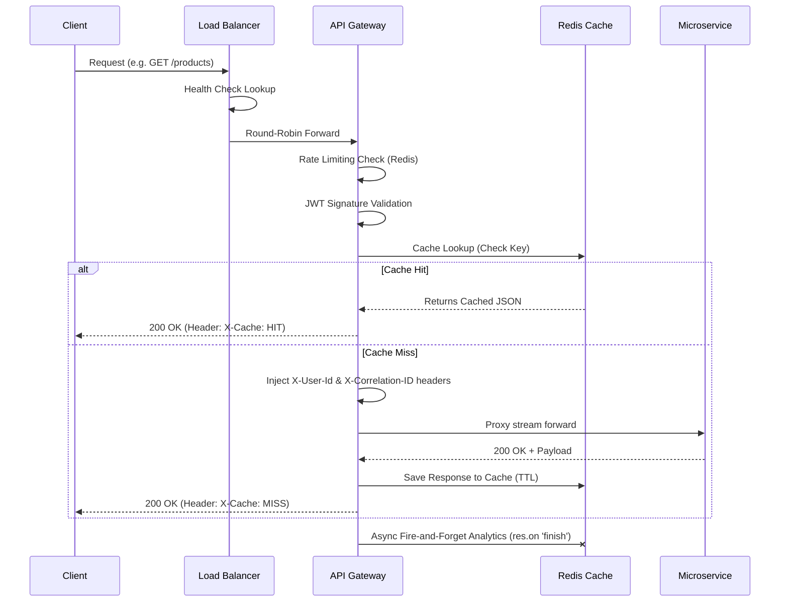

<div align="center">
  <h1>⚡ HydraGateway</h1>
  <p><b>Enterprise-Grade Microservices Platform & Layer 7 API Gateway</b></p>
  <p><i>Architected and Developed by <b>Team Vision21</b></i></p>
  <br />
  <p>
    
    
    
    
    
  </p>
</div>

---

## 📖 1. Overview

**HydraGateway** is a high-performance, resilient, and production-grade API Gateway & Microservices ecosystem built natively in **Node.js**. Designed for massive scale and fault tolerance, it showcases advanced distributed systems patterns typically found in large-scale enterprise environments.

The platform handles everything from dynamic request routing and distributed tracing to atomic rate-limiting, centralized structured logging, and robust Circuit Breaker failure management. It acts as the backbone for an e-commerce platform, coordinating Authentication, Products, Orders, and Payments seamlessly.

---

## 🏗️ 2. System Architecture

Our architecture ensures zero single points of failure, leveraging a custom Layer 7 load balancer, an active/active API gateway tier, and isolated backend microservices.



---

## 🗺️ 3. Port Mapping & Service Registry

The network is logically segmented into public-facing ingress endpoints and private internal services. 

| Component | Port | Network Exposure | Primary Responsibility |
| :--- | :--- | :--- | :--- |
| **React Dashboard** | `5173` | Public | Visualizes real-time metrics and system health. |
| **Load Balancer** | `8080` | Public | Entry point. Routes traffic across Gateway instances using Round-Robin. |
| **API Gateway 1** | `3000` | Private (VPC) | Reverse proxy, Authentication, Rate Limiting, Response Caching. |
| **API Gateway 2** | `3001` | Private (VPC) | Redundant gateway instance for failover testing. |
| **Auth Service** | `4001` | Private (VPC) | JWT Issuance, User Registration, Password Hashing. |
| **Product Service** | `4002` | Private (VPC) | Inventory management and catalog CRUD operations. |
| **Payment Service** | `4003` | Private (VPC) | Mock payment processing (simulates automated failures & latency). |
| **Order Service** | `4004` | Private (VPC) | Transactional orchestrator. Communicates with Product/Payment services. |
| **Redis Server** | `6379` | Internal | Datastore for Rate Limiting, Analytics Pipelines, and Request Caching. |
| **MongoDB** | `27017` | Internal | Highly available persistent data storage for all microservices. |

---

## 🧠 4. Under the Hood: Core Systems

The HydraGateway ecosystem implements several advanced backend architectures to guarantee resilience, speed, and visibility.

### 🛡️ Reliability & Failover
* **Stateful Layer 7 Load Balancer:** Built natively in Node.js, the LB utilizes a Round-Robin algorithm combined with active background health polling. If a Gateway drops offline, it is instantly bypassed, providing seamless automated failover.
* **Resilient Proxies:** The API Gateway utilizes `http-proxy-middleware` mapping dynamically to downstream URIs using a Service Registry. It handles downstream network timeout errors cleanly, converting them into structured JSON `502 Bad Gateway` and `504 Gateway Timeout` responses.

### ⚡ Performance & Scale
* **Zero-Latency Analytics Pipeline:** Analytics collection operates entirely outside the critical request path. By hooking into the Node.js `res.on('finish')` event and utilizing Redis pipelining (`INCR`), global traffic metrics are aggregated instantly without delaying the client's HTTP response.
* **Write-Through Response Caching:** Heavy read operations are cached at the edge (Gateway level). Origin microservices automatically bust the cache via `DEL` commands during mutations, ensuring clients always see fresh data with minimal database load.

### 🔐 Security & Observability
* **End-to-End Distributed Tracing:** Every ingress request is tagged with an `X-Correlation-ID`. This UUID is propagated through all internal microservice hops and bound to Winston logs, allowing seamless request tracing across the entire distributed network.
* **Stateless JWT Context Propagation:** Edge-level authentication validates JWTs before they reach internal services. The Gateway securely injects `X-User-Id` headers into the proxy stream, keeping internal microservices 100% stateless and decoupled from auth logic.

---

## 🛑 5. Circuit Breaker FSM (Fail-Fast & Recovery)

To prevent cascading failures across the network (such as the Order Service crashing when the Payment Service goes offline), HydraGateway uses a custom Finite State Machine (FSM) Circuit Breaker. 

Rather than hanging HTTP connections until they time out, the Circuit Breaker trips to `OPEN` after a predefined failure threshold and rejects requests instantly (`503 Service Unavailable`). 



---

## 🔄 6. Request Lifecycle Flow

This sequence demonstrates how a single client request traverses the Load Balancer, Gateway, Middlewares, Cache, and reaches the Microservice layer.



---

## 📈 7. Caching & Analytics Strategy

Redis is utilized extensively across the architecture to manage state and speed:

1. **IP-Based Rate Limiting:** Enforces quotas to prevent API abuse and DDoS attacks. 
2. **Response Caching:** Gateway proxies look for `cache:products:all` keys. If found, the database and internal network are entirely bypassed. When the Product Service handles a `POST /products` (creation), it connects to Redis and issues a `DEL cache:products:all` to ensure the cache is purged (Write-Through cache-busting).
3. **Analytics Pipeline:** Uses hashes (`HINCRBY`) to track minute-by-minute timeline views and sorted sets to track the most heavily hit endpoints. This data powers the React Dashboard.

---

## 🗂️ 8. Monorepo Architecture

The repository utilizes npm workspaces to keep boundaries strict while efficiently sharing core utilities across services.

```text
HydraGateway/
├── packages/
│   ├── load-balancer/      # L7 Router & Health Poller
│   ├── gateway/            # API Gateway & Middleware pipeline
│   ├── auth-service/       # Identity, Registration & JWT issuer
│   ├── product-service/    # Product catalog with cache invalidation
│   ├── payment-service/    # Payment processor (with simulated faults)
│   ├── order-service/      # Order orchestrator utilizing Circuit Breakers
│   └── dashboard/          # React SPA for live metrics and monitoring
│
├── shared/
│   ├── config/             # Connection pooling for MongoDB & Redis
│   ├── middleware/         # Trace ID injection & Internal Auth guards
│   └── utils/              # Winston loggers & Circuit Breaker FSM
│
├── test-cb-flow.js         # Automated Circuit Breaker resilience tests
└── package.json            # Root workspace config
```

---

## 🚀 9. Getting Started

### 📋 Prerequisites
- **Node.js** (v18+)
- **MongoDB** (Local on `27017` or Atlas URI)
- **Redis** (Local instance on `6379`)

### 🛠️ Setup
```bash
# 1. Clone & Install
git clone https://github.com/Vision21/HydraGateway.git
cd HydraGateway
npm install

# 2. Configure Environment
cp .env.example .env
```
*(Ensure `MONGO_URI` and `REDIS_HOST` point to your running database instances).*

---

## 🏃 10. Execution & Validation

### Automated Resilience Run (Recommended)
Run the automated test suite to witness the architecture in action. It spins up all services, simulates an unexpected Payment Service outage, proves the Circuit Breaker trips and recovers, and gracefully tears down the environment.
```bash
node test-cb-flow.js
```

### Manual Execution (Step-by-Step)
To run the system interactively and explore the dashboard, start the services in separate terminal sessions:

```bash
# 1. Start internal microservices
npm run dev:auth
npm run dev:product
npm run dev:payment
npm run dev:order

# 2. Start API Gateway (Run 2 instances for LB failover testing)
# (Windows PowerShell syntax shown below)
$env:GATEWAY_PORT=3000; $env:GATEWAY_INSTANCE_ID="gateway-1"; npm run dev:gateway
$env:GATEWAY_PORT=3001; $env:GATEWAY_INSTANCE_ID="gateway-2"; npm run dev:gateway

# 3. Start Load Balancer
npm run dev:lb

# 4. Start Monitoring Dashboard
npm run dev:dashboard
```

### Validation Checkpoints
1. **React Dashboard**: Open `http://localhost:5173` to see real-time charts and live microservice health statuses.
2. **Load Balancer**: Direct traffic to `http://localhost:8080/health`. Kill the `gateway-2` terminal process and watch the Load Balancer instantly route 100% of traffic to `gateway-1` without dropping requests.
3. **Tracing Logs**: Open `/logs/gateway-combined.log` and track any request through to `/logs/order-combined.log` using the `correlationId`.

---

<div align="center">
  <p>Built with ❤️ by <b>Team Vision21</b></p>
</div>
