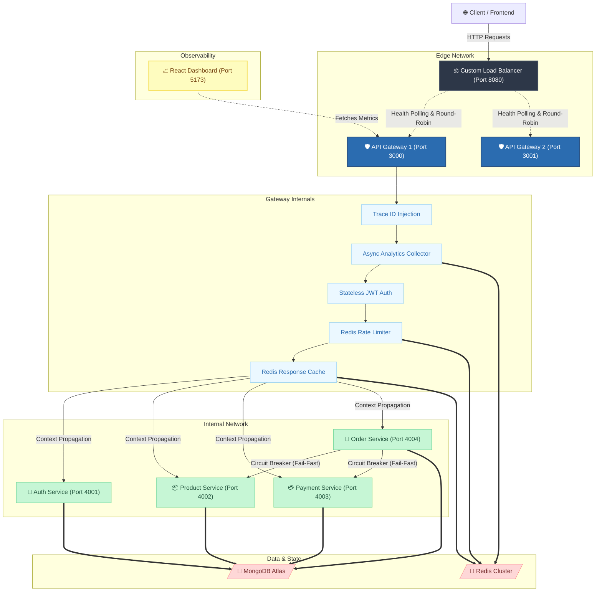

<div align="center">
  <h1>⚡ HydraGateway</h1>
  <p><b>Enterprise-Grade Microservices Platform & API Gateway</b></p>
  <p>
    
    
    
    
    
    
  </p>
</div>

---

## 📖 1. Overview

**HydraGateway** is a high-performance, resilient, and production-grade API Gateway & Microservices ecosystem built with **Node.js**. Designed for scale and fault tolerance, it showcases industry-standard distributed systems patterns.

The platform handles everything from dynamic request routing and distributed tracing to atomic rate-limiting, centralized structured logging, and robust Circuit Breaker failure management. It acts as the backbone for an e-commerce platform, coordinating Authentication, Products, Orders, and Payments.

---

## 🏗️ 2. System Architecture

Our architecture ensures zero single points of failure, leveraging a custom Layer 7 load balancer, an active/active API gateway tier, and isolated microservices.



*(Note: The diagram above uses strictly quoted labels to ensure perfect rendering across all Markdown platforms).*

---

## 🗺️ 3. Port Mapping & Service Registry

To run the full stack locally, the system spans multiple ports. The network is logically segmented into public-facing ingress and private internal services.

| Component | Port | Network Exposure | Primary Responsibility |
| :--- | :--- | :--- | :--- |
| **React Dashboard** | `5173` | Public | Visualizes real-time metrics and system health. |
| **Load Balancer** | `8080` | Public | Entry point. Routes traffic across Gateway instances using Round-Robin. |
| **API Gateway 1** | `3000` | Private (VPC) | Reverse proxy, Authentication, Rate Limiting, Response Caching. |
| **API Gateway 2** | `3001` | Private (VPC) | Redundant gateway instance for failover testing. |
| **Auth Service** | `4001` | Private (VPC) | JWT Issuance, User Registration, Password Hashing. |
| **Product Service** | `4002` | Private (VPC) | Inventory management and catalog CRUD operations. |
| **Payment Service** | `4003` | Private (VPC) | Mock payment processing (simulates failures & latency). |
| **Order Service** | `4004` | Private (VPC) | Transactional orchestrator. Communicates with Product/Payment services. |
| **Redis Server** | `6379` | Internal | In-memory datastore for Rate Limiting, Analytics, and Caching. |
| **MongoDB** | `27017` | Internal | Persistent data storage for all microservices. |

---

## ✨ 4. Enterprise System Features

### ⚖️ Custom Layer 7 Load Balancer (Phase 11)
A Node.js L7 Load Balancer built from scratch. It utilizes a **Round-Robin distribution algorithm**, maintains an in-memory pointer, and performs active background health polling (`GET /health`) against Gateway targets every 10 seconds. If a gateway drops offline, the LB performs **automated failover** without dropping client requests.

### 🛡️ Circuit Breaker Resilience (Phase 12)
Internal state machines (`CLOSED` ⇄ `OPEN` ⇄ `HALF_OPEN`) wrap critical service-to-service calls (e.g., Order ➔ Payment) to prevent cascading failures. If the Payment service goes down, the Circuit Breaker trips instantly (Fail-Fast), preventing thread pool exhaustion. It includes a cooldown period and probe requests for self-healing, as well as a retry loop for transient network glitches.

### 📊 Zero-Latency Analytics (Phase 10)
Instead of writing to a database on every request, the Gateway utilizes the `res.on('finish')` event hook and Redis pipelining (`INCR`) to capture traffic metrics asynchronously. This guarantees that analytics collection adds **zero latency** to the client's HTTP response. 

### 📈 React Monitoring Dashboard (Phase 13)
A standalone Single Page Application (SPA) built with React, Vite, Tailwind CSS, and Recharts. It queries the Gateway's analytics API to visualize live system health, API latency, traffic volumes, and a top-endpoints leaderboard.

### 🧩 Distributed Logging & Tracing (Phase 9)
Unified structured logging via `Winston` and `Morgan`. Every ingress request receives a globally unique `X-Correlation-ID`. This ID is injected into HTTP headers and propagated across all internal microservice hops, allowing seamless, unified request tracing in tools like ELK/Datadog.

### 🚀 Redis Response Caching (Phase 8)
Accelerates heavy read operations via Gateway-level caching. `GET` requests (e.g., `/v1/products`) are cached in Redis. The origin microservices handle **write-through cache busting**—when a product is updated, the Product Service issues a `DEL` command to Redis to ensure clients immediately see fresh data.

### 🔐 Security, Context Propagation & Rate Limiting
Distributed rate limiting backed by Redis protects against DDoS. Stateless JWT authentication occurs at the edge (Gateway). The Gateway strips the token, decodes it, and injects `X-User-Id` and `X-User-Role` headers into the proxy stream. Downstream services remain completely stateless and securely trust the internal headers.

---

## 🗂️ 5. Monorepo Project Structure

The repository is built as an npm workspace monorepo, keeping boundaries strict while sharing core utilities.

```text
HydraGateway/
├── packages/
│   ├── load-balancer/      # L7 Router & Health Poller
│   ├── gateway/            # API Gateway & Middleware pipeline
│   ├── auth-service/       # Identity, Registration & JWT issuer
│   ├── product-service/    # Product catalog with cache invalidation
│   ├── payment-service/    # Payment processor (with simulated latency/faults)
│   ├── order-service/      # Order orchestrator utilizing Circuit Breakers
│   └── dashboard/          # React SPA for live metrics and monitoring
│
├── shared/                 # Core utilities shared dynamically
│   ├── config/             # Connection pooling for MongoDB & Redis
│   ├── middleware/         # Trace ID injection & Internal Auth guards
│   └── utils/              # Winston loggers, Error formats, Circuit Breaker FSM
│
├── test-cb-flow.js         # Automated Circuit Breaker resilience tests
└── README.md               # This documentation file
```

---

## 🚀 6. Getting Started

### Prerequisites
- **Node.js** (v18+)
- **MongoDB** (Local on `27017` or Atlas URI)
- **Redis** (Local instance on `6379`)

### 1. Installation
Clone the repository and install all workspace dependencies:
```bash
npm install
```

### 2. Configuration
Copy the environment template:
```bash
cp .env.example .env
```
Ensure `MONGO_URI` and `REDIS_HOST` point to your running database instances.

### 3. Launching the Ecosystem

**Option A: Automated Resilience Test (Recommended)**
Run the automated test suite. It spins up all services, simulates a Payment Service outage, proves the Circuit Breaker trips and recovers, and then shuts down gracefully.
```bash
node test-cb-flow.js
```

**Option B: Manual Execution**
To run the system interactively, start the services in separate terminal sessions (or background processes):
```bash
# 1. Start internal microservices
npm run dev:auth
npm run dev:product
npm run dev:payment
npm run dev:order

# 2. Start API Gateway (Run 2 instances for LB failover testing)
# (Windows PowerShell syntax shown below)
$env:GATEWAY_PORT=3000; $env:GATEWAY_INSTANCE_ID="gateway-1"; npm run dev:gateway
$env:GATEWAY_PORT=3001; $env:GATEWAY_INSTANCE_ID="gateway-2"; npm run dev:gateway

# 3. Start Load Balancer
npm run dev:lb

# 4. Start Monitoring Dashboard
npm run dev:dashboard
```

---

## 🔬 7. Observability & Validation

Once the system is running, you can easily validate the architecture:

### 1. View the Monitoring Dashboard
Open `http://localhost:5173` in your browser. Send API traffic through Postman and watch the live traffic charts and response time metrics update automatically.

### 2. Test the Load Balancer Failover
Direct all traffic to `http://localhost:8080/health`. Check the `X-LB-Selected-Gateway` response header. It will alternate between `gateway-1` and `gateway-2`. 
Kill the `gateway-2` process in your terminal, wait 10 seconds, and watch the load balancer automatically route 100% of traffic to `gateway-1` without dropping requests.

### 3. Trace a Request
Open `logs/gateway-combined.log` and `logs/order-combined.log`. You will see identical `correlationId` UUIDs linking the gateway's ingress log to the downstream service's execution log, demonstrating true distributed tracing.

---

## 👥 Authors & License

Developed and maintained by **Team Vision21**.
This project is an advanced demonstration of modern backend architectures, microservice orchestration, and system reliability engineering.
