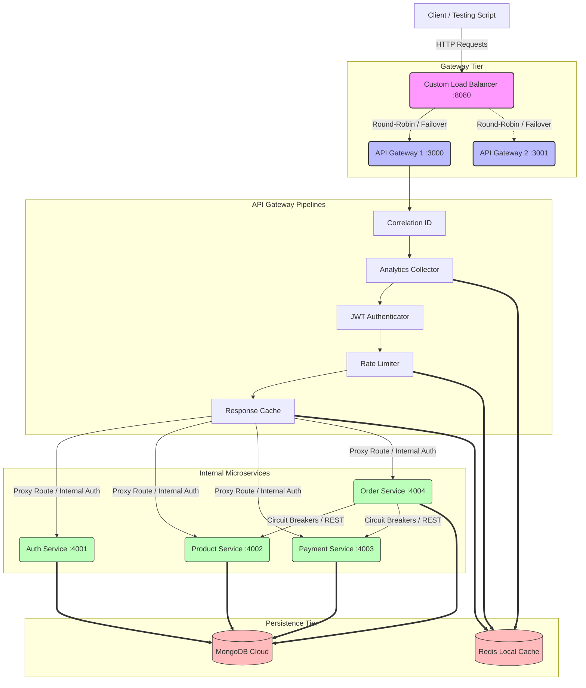

# ⚡ HydraGateway – Enterprise Microservices Platform
### 👥 Developed by Team Vision21

HydraGateway is a high-performance, resilient, and production-grade API Gateway & Load Balancer architecture built with **Node.js, Express, MongoDB, and Redis**. 

This monorepo project showcases modern microservices patterns, including distributed tracing, dynamic rate-limiting, response caching, centralized structured logging, active health polling, real-time analytics collection, and stateless round-robin load balancing with automatic failover.

---

## 🏗️ 1. Architecture Overview

Here is how traffic flows through the HydraGateway ecosystem:



---

## 🗂️ 2. Monorepo Project Structure

The project is structured as an npm workspace monorepo under the `packages/` directory, supported by a shared infrastructure tier (`shared/`).

```
HydraGateway/
├── packages/
│   ├── load-balancer/      # Custom Round-Robin load balancer with active health checks (:8080)
│   ├── gateway/            # API Gateway with proxy, JWT auth, rate limiting & caching (:3000/:3001)
│   ├── auth-service/       # Identity service managing user registration and logins (:4001)
│   ├── product-service/    # Product inventory manager with write-through cache busting (:4002)
│   ├── payment-service/    # Payment processor simulation (:4003)
│   └── order-service/      # Transactional order orchestrator with internal circuit breakers (:4004)
│
├── shared/                 # Core utilities shared dynamically across all workspaces
│   ├── config/             # MongoDB connection pooling & resilient Redis client configs
│   ├── middleware/         # Correlation ID (distributed tracing) & inter-service authentication
│   └── utils/              # Winston structured logging, custom error handling & Circuit Breaker FSM
│
├── test-flow.js            # Automated E2E integration test runner
├── .env.example            # Master environment variables template
└── README.md               # This documentation file
```

---

## 🚦 3. Core Features & Phase Breakdowns

### 🔄 Phase 1 & 2: Monorepo Scaffold & Authentication
* **Monorepo Structure**: Utilizes npm workspaces to manage individual dependencies while sharing common code.
* **Shared Database & Redis Adapters**: High-availability MongoDB pooling and `ioredis` wrappers featuring exponential back-off reconnection strategies.
* **Auth Service**: Standardized registration and stateless JWT logins using secure `bcryptjs` password hashing.

### 📦 Phase 3, 4 & 5: Inventory & Order Orchestration
* **Product CRUD**: Offers product catalog endpoints with soft-delete patterns (`isActive: false`).
* **Payment Processor**: Simulates financial transactions with automated randomized failures (10% chance) and processing latencies.
* **Order Orchestrator**: Coordinates stock checking and charge execution across services. Employs a custom **Circuit Breaker** state machine (`CLOSED` ⇄ `OPEN` ⇄ `HALF_OPEN`) to prevent service failures from cascading.

### 🛡️ Phase 6, 7, 8 & 9: API Gateway Foundations
* **Reverse Proxy routing**: Handled by `http-proxy-middleware`, dynamically mapping requests to target microservices based on configurations.
* **IP-based Rate Limiter**: Prevents DDoS and API abuse using atomic Redis pipelines.
* **Response Cache**: Speeds up GET endpoints like `/v1/products` with transparent Redis caching (`X-Cache: HIT / MISS` headers) and automatic write-through cache-busting.
* **Distributed Tracing**: Standardizes requests with an `X-Correlation-ID` header injected on input and propagated through microservice calls for seamless log stitching.

### 📊 Phase 10: Real-Time Analytics Pipeline
* **Zero-Latency Monitoring**: Registers a non-blocking `res.on('finish')` listener in the gateway pipeline to log response status, latency, and target paths.
* **Aggregated Redis Metrics**: Stores global request stats, failure/success rates, service breakdowns, endpoint hits, and timeline charts using optimized Redis data structures (Strings, Hashes, Sets).
* **Monitoring Exemption**: Ensures `/analytics` and `/health` endpoints are exempt from rate limiting so logging infrastructure is never throttled.

### ⚖️ Phase 11: Stateful Load Balancer
* **Round-Robin Router**: Forwards traffic equally across available API Gateway ports.
* **Active Health Checking**: Background poller checks `/health` of registered gateway targets every 10 seconds.
* **Automatic Failover**: Instantly redirects requests to live nodes when a gateway instance drops offline, reintroducing it once the threshold for healthy responses is met.

---

## 🚀 4. How to Set Up & Run the Project

### Prerequisites
* **Node.js** (v18 or higher recommended)
* **MongoDB** (Local instance or Atlas connection string)
* **Redis** (Local instance running on default port `6379`)

### 1. Installation
In the project root directory, install all service and root dependencies using:
```bash
npm install
```

### 2. Configure Environment Variables
Copy `.env.example` to `.env` in the root:
```bash
cp .env.example .env
```
Open `.env` and verify that your `MONGO_URI` and `REDIS_HOST`/`REDIS_PORT` are configured correctly.

### 3. Start Databases
Make sure MongoDB and Redis are running. For instance, to start Redis locally:
```bash
redis-server
```

---

## 🏃 5. Launching the Services

You can run the full system in two ways: through the automated test runner, or manually starting each service.

### Option A: Automated E2E Test Suite (Recommended)
This runs the full microservice flow, tests all features, asserts proper outputs, and shuts everything down:
```bash
node test-flow.js
```

### Option B: Manual Execution
Open separate terminal tabs and run each service using the monorepo root scripts:

```bash
# 1. Downstream services
npm run dev:auth          # Auth Service on Port 4001
npm run dev:product       # Product Service on Port 4002
npm run dev:payment       # Payment Service on Port 4003
npm run dev:order         # Order Service on Port 4004

# 2. Start two API Gateway instances for Load Balancer testing
# Terminal Gateway 1 (Port 3000)
$env:GATEWAY_PORT=3000; $env:GATEWAY_INSTANCE_ID="gateway-1"; npm run dev:gateway
# Terminal Gateway 2 (Port 3001)
$env:GATEWAY_PORT=3001; $env:GATEWAY_INSTANCE_ID="gateway-2"; npm run dev:gateway

# 3. Start Load Balancer
npm run dev:lb            # Load Balancer on Port 8080
```
*(For Windows CMD, replace the environment variable assignments with: `set GATEWAY_PORT=3000&& set GATEWAY_INSTANCE_ID=gateway-1&& npm run dev:gateway`)*

---

## 🔬 6. Quick Verification Guide

Verify load balancing and proxy routing by executing curl requests to the Load Balancer port (`8080`):

### 1. Check Load Balancer Status
Returns the list of downstream gateways and their health metrics:
```bash
curl http://localhost:8080/lb-health
```

### 2. User Registration & Login (Routings)
```bash
# Register a new user account
curl -X POST http://localhost:8080/v1/auth/register \
  -H "Content-Type: application/json" \
  -d '{"email":"developer@example.com","password":"securePassword123","name":"Developer"}'

# Login to retrieve token
curl -X POST http://localhost:8080/v1/auth/login \
  -H "Content-Type: application/json" \
  -d '{"email":"developer@example.com","password":"securePassword123"}'
```

### 3. Check Analytics Reports (Bypasses JWT/Rate limits)
```bash
# Fetch global traffic and status breakdowns
curl http://localhost:8080/analytics/summary

# Fetch top hit endpoints
curl http://localhost:8080/analytics/endpoints?limit=5
```

---

## 🛡️ 7. Distributed Logging & Monitoring
* Logs are aggregated in the project root `/logs` directory under:
  * `gateway.log` (Winston JSON format logs for Gateway requests)
  * `auth.log`, `product.log`, `payment.log`, `order.log`, `load-balancer.log`
* In development, terminal windows will output clean, human-readable colorized strings showing correlation IDs to allow easy step-by-step request tracking.

---

## 👥 Authors
This project is developed and maintained by **Team Vision21**.

